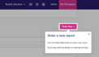

## UI copy 
## Guided tours
I've used a few different Digital Adoption Platforms (DAPs) to create guided tours in applications. 
Guided tours are a great way to orient and onboard the user, and DAPs are often powerful, easy to use and require very little in the way of developer effort. 
By default, guided tours are launched from a separate item as part of the overlay. This seemed off-brand and potentially confusing, so with a little help from a developer, we created a menu button that launches the tours. 

It also gave us an opportunity to draw more attention to the help menu and other resources available to the user. 

The DAP I used has powerful features that enable the user to learn by doing, for example we can ask them to interact with the UI directly rather than simply showing where the button is. 

### How digital adoption platforms work 

